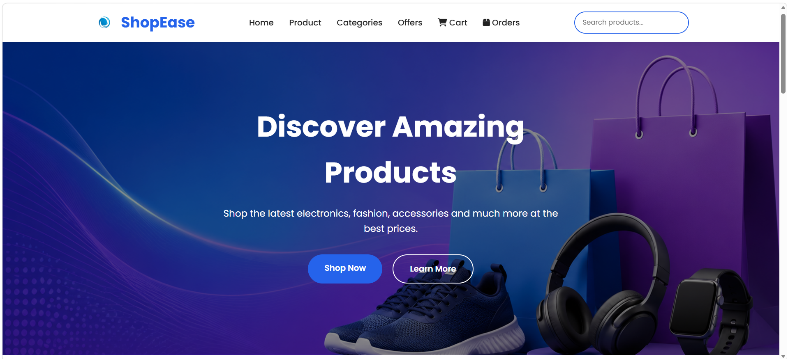
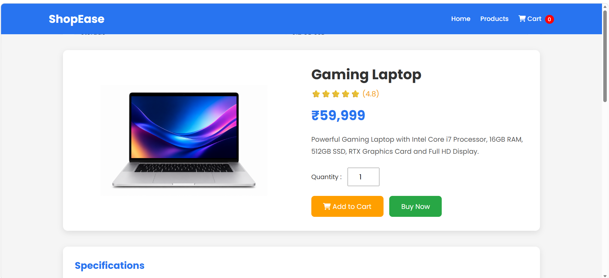
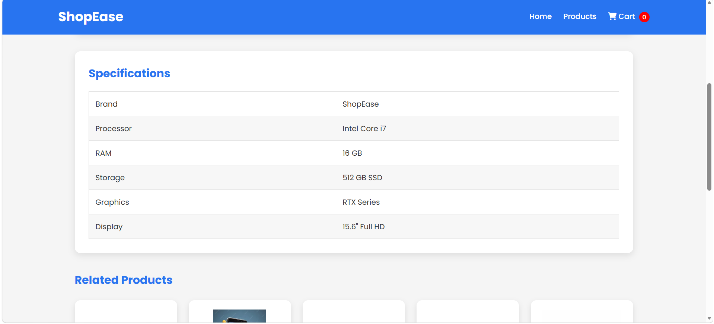
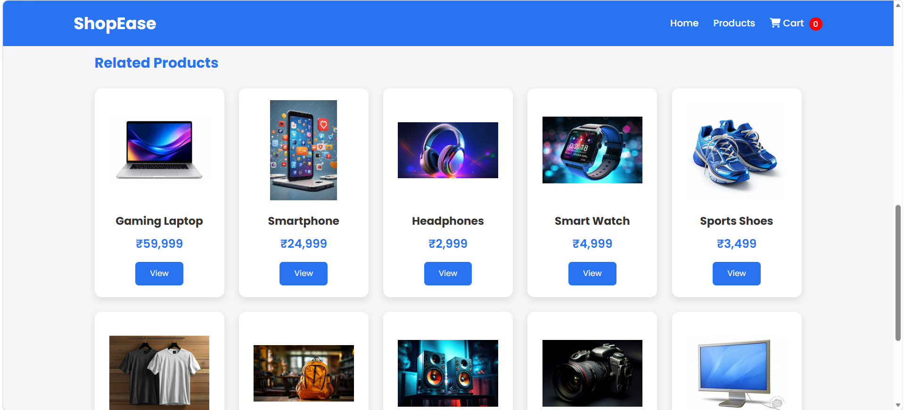
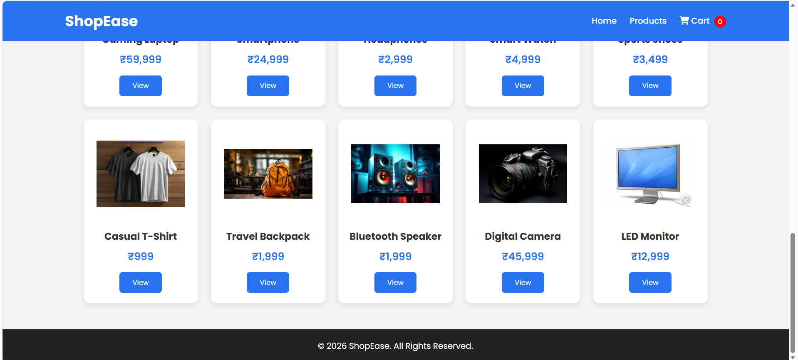
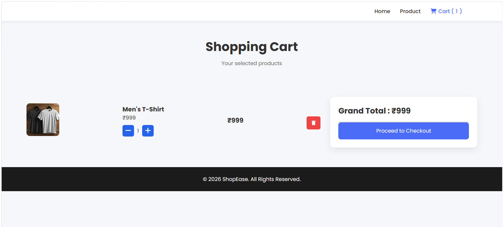
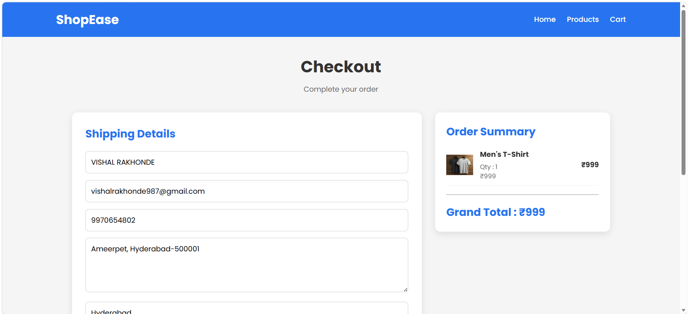
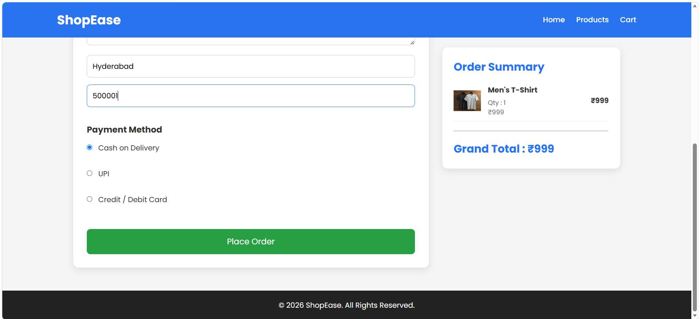
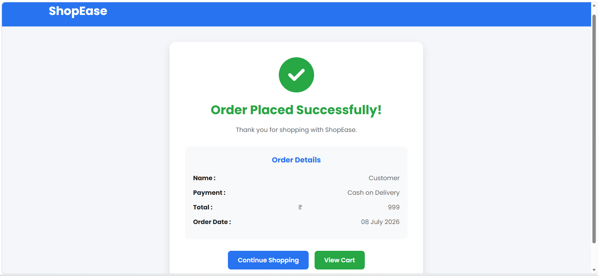

# 🛒 ShopEase - E-Commerce Website

A modern, responsive **E-Commerce Website** built using **HTML, CSS, and JavaScript**. This project provides a clean shopping experience with product browsing, cart management, checkout, and order history using Local Storage.

---

## 📌 Features

- 🏠 Responsive Home Page
- 🔍 Product Search
- 📦 Product Details Page
- 🛒 Shopping Cart
- ➕ Add to Cart
- ➖ Increase/Decrease Quantity
- 💳 Checkout Page
- ✅ Order Success Page
- 📜 Order History
- 💾 Local Storage Support
- 📱 Mobile-Friendly Design

---

## 🛠️ Technologies Used

- HTML5 (Structure)
- CSS3 (Responsive UI Design)
- JavaScript ES6 (Dynamic Functionality)
- Font Awesome Icons
- Browser Local Storage API

---

## 📂 Project Structure

```text
ShopEase/
│
├── icons/
│   ├── cart.svg
│   ├── search.svg
│   ├── user.svg
│   └── menu.svg
│
├── images/
│   ├── hero-banner.jpg
│   ├── laptop.jpg
│   ├── smartphone.jpg
│   ├── headphones.jpg
│   ├── smartwatch.jpg
│   ├── tshirt.jpg
│   ├── bluetooth-speaker.jpg
│   ├── backpack.jpg
│   ├── camera.jpg
│   ├── monitor.jpg
│   ├── shoes.jpg
│   └── logo.png
│
├── index.html
├── style.css
├── script.js
│
├── product.html
├── product.css
├── product.js
│
├── cart.html
├── cart.css
├── cart.js
│
├── checkout.html
├── checkout.css
├── checkout.js
│
├── order-success.html
├── order-success.css
├── order-success.js
│
├── order-history.html
├── order-history.css
├── order-history.js
│
├── README.md
│
└── screenshots/
    ├── home.png
    ├── product1.png
    ├── product2.png
    ├── product3.png
    ├── product4.png
    ├── cart.png
    ├── checkout1.png
    ├── checkout2.png
    └── order-success.png
``````

---

## 🚀 How to Run

1. Download or Clone this repository.
2. Open the project folder in **Visual Studio Code**.
3. Open **index.html** in your browser.

No additional installation is required.

---

## ✨ Future Improvements

- User Login & Registration
- Wishlist
- Product Categories
- Product Reviews & Ratings
- Online Payment Gateway
- Admin Dashboard
- Backend Integration (PHP/Node.js)
- Database (MySQL/MongoDB)

---

## 📸 Screenshots

### 🏠 Home Page



### 📦 Product Details









### 🛒 Shopping Cart



### 💳 Checkout





### ✅ Order Success


---

## 👨‍💻 Author

**Yoginand Digambar Bhokare**

🎓 BCA Graduate  
💻 Front-End Developer  
🌱 Learning Full Stack Python Development  

Skills:
HTML | CSS | JavaScript | Python | Django | SQL

GitHub: https://github.com/yogibhokare18

---

## ⭐ Support

If you like this project, please give it a **⭐ Star** on GitHub.

---

## 📄 License

This project is created for learning and educational purposes.
